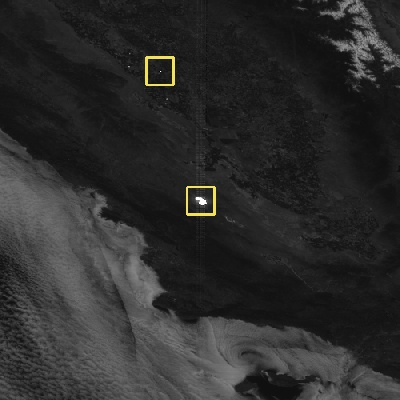
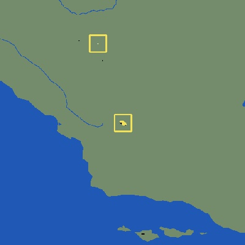
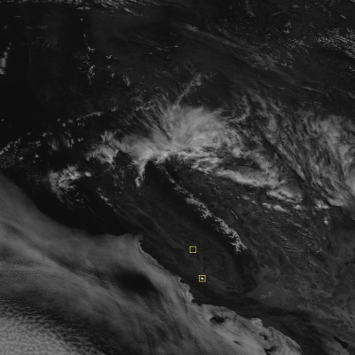
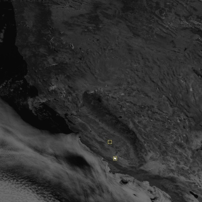
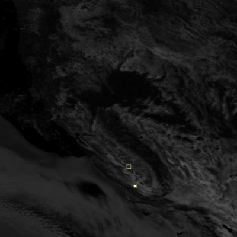
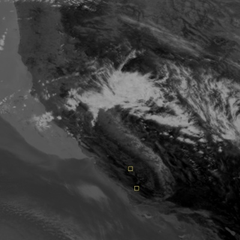

# abi-sparkle

<p>
<a href="https://github.com/heregoesradio/heregoes/blob/main/LICENSE.txt"></a>
<a href="https://github.com/psf/black"></a>
</p>

abi-sparkle is a Python 3.8 package for detecting and characterizing anthropogenic specular reflections, or "sparkles", in GOES-R ABI imagery. Large reflective structures like solar power plants and commercial greenhouses sometimes reflect sunlight directly into GOES-R sensors, interfering with operational GOES-R products like the Fire Detection and Characterization Algorithm (FDCA). This "sparkle" detection algorithm is described in the prepublication manuscript "Anthropogenic Specular Interference in the Operational GOES-R Fire Product".

<p float="left">


</p>

---

## Setup

This package uses the included [heregoes](https://github.com/heregoesradio/heregoes/) library and its dependencies for processing GOES-R ABI imagery.
To get started, clone this repository and install the Conda environment:
```
git clone --recurse-submodules https://github.com/wx-star/abi-sparkle.git
cd abi-sparkle
conda env create -f external/heregoes/heregoes-env.yml
conda activate heregoes-env
```

Optional environmental variables for the [heregoes](https://github.com/heregoesradio/heregoes/) library:
- `HEREGOES_ENV_PARALLEL`: Defaults to `False`
- `HEREGOES_ENV_NUM_CPUS`: Number of CPUs to use if `HEREGOES_ENV_PARALLEL` is `True`. Defaults to the number of CPUs reported by the OS
- `HEREGOES_ENV_IREMIS_DIR`: Directory path of the UW CIMSS IREMIS dataset which can be downloaded [here](https://cimss.ssec.wisc.edu/iremis/)

---

## Example usage

### Invoking the Sparkle Detection and Characterization Algorithm (SDCA)

With ABI L1b radiance netCDF files for the required 0.64 μm (`c02_nc`), 1.61 μm (`c05_nc`), 3.9 μm (`c07_nc`), and 11.2 μm (`c14_nc`) spectral bands:

```python
from abisparkle import sdca

sparkle = sdca.Sparkle(c02_nc, c05_nc, c07_nc, c14_nc)
```

### Generating sparkle detection images

With the `sparkle` object from the previous step:

```python
import cv2

cv2.imwrite("sparkle-c02-rf.jpg", sparkle.SDCAImage.c02_rf_sparkle)
cv2.imwrite("sparkle-c05-rf.jpg", sparkle.SDCAImage.c05_rf_sparkle)
cv2.imwrite("sparkle-c07-rf.jpg", sparkle.SDCAImage.c07_rf_sparkle)
cv2.imwrite("sparkle-c07-bt.jpg", sparkle.SDCAImage.c07_bt_sparkle)
```
<p float="left">




</p>

### Inspecting detected sparkle metadata

With the `sparkle` object from the previous step:

```python
import json

clusters = sparkle.SDCAMeta.get_clusters()
print(json.dumps(clusters, indent=4))
```

Which returns basic metadata for centroids of sparkle clusters:

```
[
    {
        "id": "2019-06-12T183627Z_d669e3e6-239e-4b0c-b09d-6e04cbe86fd8",
        "centroid_y": 1406,
        "centroid_x": 1087,
        "centroid_lat": 36.39684,
        "centroid_lon": -120.11221,
        "centroid_google_maps": "https://www.google.com/maps/@?api=1&map_action=map&center=36.39684,-120.11221&zoom=14&basemap=satellite",
        "centroid_omega_deg": 24.44872,
        "centroid_beta_deg": 27.137641,
        "centroid_gamma_deg": 180.12284,
        "size": 2
    },
    {
        "id": "2019-06-12T183627Z_098a7dea-f04a-43a4-859d-054026115e1d",
        "centroid_y": 1568,
        "centroid_x": 1138,
        "centroid_lat": 35.37968,
        "centroid_lon": -120.05836,
        "centroid_google_maps": "https://www.google.com/maps/@?api=1&map_action=map&center=35.37968,-120.05836&zoom=14&basemap=satellite",
        "centroid_omega_deg": 24.42505,
        "centroid_beta_deg": 26.050493,
        "centroid_gamma_deg": 180.30197,
        "size": 93
    }
]
```

Detailed metadata for individual pixels within a cluster may be retrieved with the `clusters` object from the previous step:

```python
cluster_pixels = sparkle.SDCAMeta.get_cluster_members(clusters[0]['id'])
print(json.dumps(cluster_pixels, indent=4))
```

Which returns:

```
[
    {
        "event": "valid_sparkle",
        "time_coverage_start": "2019-06-12T18:36:27Z",
        "time_coverage_end": "2019-06-12T18:36:33Z",
        "y": 1406,
        "x": 1087,
        "lat": 36.39684,
        "lon": -120.11221,
        "google_maps": "https://www.google.com/maps/@?api=1&map_action=map&center=36.39684,-120.11221&zoom=14&basemap=satellite",
        "cluster": {
            "id": "2019-06-12T183627Z_d669e3e6-239e-4b0c-b09d-6e04cbe86fd8",
            "centroid_y": 1406,
            "centroid_x": 1087,
            "centroid_lat": 36.39684,
            "centroid_lon": -120.11221,
            "centroid_google_maps": "https://www.google.com/maps/@?api=1&map_action=map&center=36.39684,-120.11221&zoom=14&basemap=satellite",
            "centroid_omega_deg": 24.44872,
            "centroid_beta_deg": 27.137641,
            "centroid_gamma_deg": 180.12284,
            "size": 2
        },
        "files": {
            "c02": "OR_ABI-L1b-RadM1-M6C02_G17_s20191631836275_e20191631836333_c20191631836362.nc",
            "c05": "OR_ABI-L1b-RadM1-M6C05_G17_s20191631836275_e20191631836333_c20191631836368.nc",
            "c07": "OR_ABI-L1b-RadM1-M6C07_G17_s20191631836275_e20191631836344_c20191631836375.nc",
            "c14": "OR_ABI-L1b-RadM1-M6C14_G17_s20191631836275_e20191631836333_c20191631836377.nc"
        },
        "dqfs": {
            "c02": 2,
            "c05": 0,
            "c07": 0,
            "c14": 0
        },
        "rads": {
            "c02": 628.98724,
            "c05": 52.21701,
            "c07": 1.45909,
            "c14": 11.22869
        },
        "rfs": {
            "c02": 1.2515724,
            "c05": 0.6971596,
            "c07": 0.2398981
        },
        "bts": {
            "c07": 323.73376,
            "c14": 312.35651
        },
        "devs": {
            "c02_rf": 1.1419381,
            "c05_rf": 0.5045494,
            "c07_rf": 0.1003152,
            "c14_bt": 1.05938
        },
        "stdevs": {
            "c02_rf": 0.0480985,
            "c05_rf": 0.0600242,
            "c07_rf": 0.0418818,
            "c14_bt": 2.88706
        },
        "nav": {
            "sun_za_deg": 22.408041,
            "sun_az_deg": 120.3802,
            "sat_za_deg": 45.913727,
            "sat_az_deg": 207.40711,
            "glint_angle_deg": 51.02323,
            "omega_deg": 24.44872,
            "beta_deg": 27.137641,
            "gamma_deg": 180.12284,
            "area_m": 271819.78
        },
        "flags": [
            "pixel_considered_on_first_pass",
            "pixel_had_1_window_iterations",
            "pixel_validated_by_window_deviation"
        ],
        "debug": {
            "algo_passes": 1,
            "window_radius": 15,
            "window_iterations": 1,
            "window_valid_proportion": 0.9979188
        }
    },
    {
        "event": "valid_sparkle",
        "time_coverage_start": "2019-06-12T18:36:27Z",
        "time_coverage_end": "2019-06-12T18:36:33Z",
        "y": 1406,
        "x": 1088,
        "lat": 36.39703,
        "lon": -120.10597,
        "google_maps": "https://www.google.com/maps/@?api=1&map_action=map&center=36.39703,-120.10597&zoom=14&basemap=satellite",
        "cluster": {
            "id": "2019-06-12T183627Z_d669e3e6-239e-4b0c-b09d-6e04cbe86fd8",
            "centroid_y": 1406,
            "centroid_x": 1087,
            "centroid_lat": 36.39684,
            "centroid_lon": -120.11221,
            "centroid_google_maps": "https://www.google.com/maps/@?api=1&map_action=map&center=36.39684,-120.11221&zoom=14&basemap=satellite",
            "centroid_omega_deg": 24.44872,
            "centroid_beta_deg": 27.137641,
            "centroid_gamma_deg": 180.12284,
            "size": 2
        },
        "files": {
            "c02": "OR_ABI-L1b-RadM1-M6C02_G17_s20191631836275_e20191631836333_c20191631836362.nc",
            "c05": "OR_ABI-L1b-RadM1-M6C05_G17_s20191631836275_e20191631836333_c20191631836368.nc",
            "c07": "OR_ABI-L1b-RadM1-M6C07_G17_s20191631836275_e20191631836344_c20191631836375.nc",
            "c14": "OR_ABI-L1b-RadM1-M6C14_G17_s20191631836275_e20191631836333_c20191631836377.nc"
        },
        "dqfs": {
            "c02": 2,
            "c05": 0,
            "c07": 0,
            "c14": 0
        },
        "rads": {
            "c02": 628.98724,
            "c05": 55.85741,
            "c07": 1.34621,
            "c14": 10.8618
        },
        "rfs": {
            "c02": 1.2515724,
            "c05": 0.7457634,
            "c07": 0.218258
        },
        "bts": {
            "c07": 321.46637,
            "c14": 309.89371
        },
        "devs": {
            "c02_rf": 1.1443776,
            "c05_rf": 0.5547279,
            "c07_rf": 0.0802357,
            "c14_bt": -1.31474
        },
        "stdevs": {
            "c02_rf": 0.0303674,
            "c05_rf": 0.0569459,
            "c07_rf": 0.0411425,
            "c14_bt": 2.81633
        },
        "nav": {
            "sun_za_deg": 22.403804,
            "sun_az_deg": 120.39047,
            "sat_za_deg": 45.916507,
            "sat_az_deg": 207.41608,
            "glint_angle_deg": 51.02448,
            "omega_deg": 24.44903,
            "beta_deg": 27.137822,
            "gamma_deg": 180.13725,
            "area_m": 271827.97
        },
        "flags": [
            "pixel_considered_on_first_pass",
            "pixel_had_1_window_iterations",
            "pixel_validated_by_window_deviation"
        ],
        "debug": {
            "algo_passes": 1,
            "window_radius": 15,
            "window_iterations": 1,
            "window_valid_proportion": 0.9968783
        }
    }
]
```
